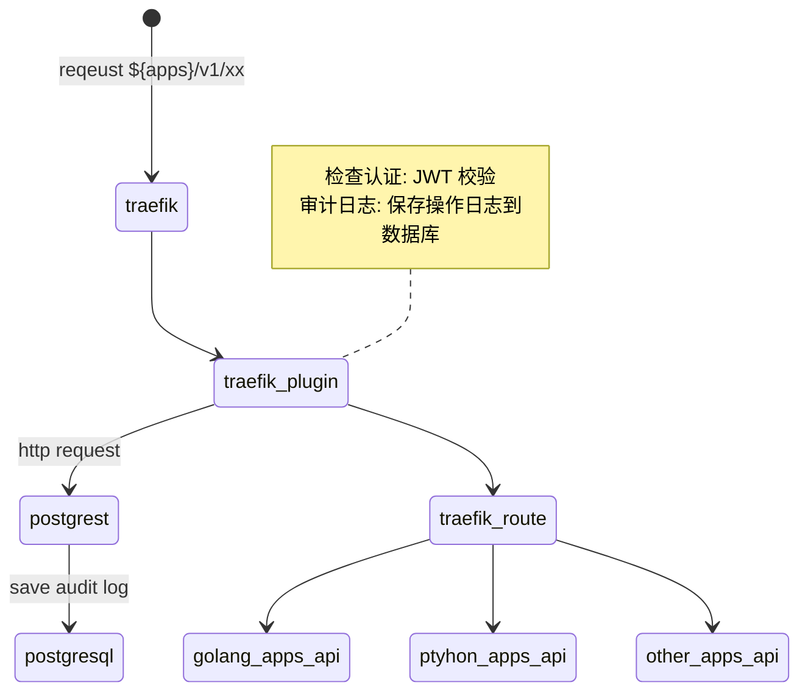

## traefik 
因 traefik 只支持 使用 golang 源生项目的包去创建插件，所以写进数据库需经 postgrest

```mermaid
stateDiagram-v2
    [*] --> traefik: reqeust ${apps}/v1/xx
    traefik --> traefik_plugin
    traefik_plugin --> postgrest: http request
    postgrest      --> postgresql: save audit log
    traefik_plugin --> traefik_route
    traefik_route  --> golang_apps_api
    traefik_route  --> ptyhon_apps_api
    traefik_route  --> other_apps_api

    note left of traefik_plugin
        检查认证: JWT 校验
        审计日志: 保存操作日志到数据库
    end note
```